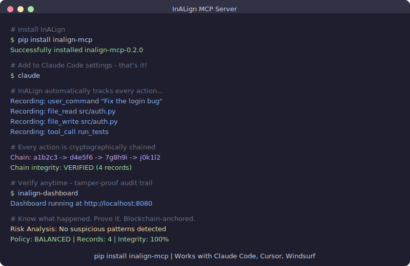

# InALign

[](https://pypi.org/project/inalign-mcp/)
[](LICENSE)
[](https://www.python.org/downloads/)
[](https://modelcontextprotocol.io)

**AI Agent Governance Platform** — Record, verify, and prove every AI agent action.

<p align="center">
  
</p>

AI coding agents read files, execute commands, and modify your codebase autonomously. But who audits the AI? InALign provides cryptographic provenance chains, behavioral analysis, and tamper-proof audit trails — so you always know what happened and can prove it.

## Why InALign?

1. **Record** — Every agent action is captured in a SHA-256 hash chain. One record tampered? The entire chain breaks.
2. **Analyze** — GraphRAG behavioral analysis detects suspicious patterns: data exfiltration, privilege escalation, unusual tool sequences.
3. **Prove** — Blockchain-anchored audit trails that anyone can independently verify. No trust required.

## Quick Start

### Install

```bash
pip install inalign-mcp
```

### Configure with Claude Code

Add to `~/.claude/settings.json`:

```json
{
  "mcpServers": {
    "inalign": {
      "command": "inalign-mcp",
      "env": {
        "NEO4J_URI": "neo4j+s://your-instance.neo4j.io",
        "NEO4J_USER": "neo4j",
        "NEO4J_PASSWORD": "your-password"
      }
    }
  }
}
```

### Configure with Cursor

Add to `~/.cursor/mcp.json`:

```json
{
  "mcpServers": {
    "inalign": {
      "command": "inalign-mcp",
      "env": {
        "NEO4J_URI": "neo4j+s://your-instance.neo4j.io",
        "NEO4J_USER": "neo4j",
        "NEO4J_PASSWORD": "your-password"
      }
    }
  }
}
```

That's it. InALign will automatically track every agent action.

## Features

### Provenance Tracking
- **Cryptographic chains** - Every action is hashed and linked to the previous record
- **W3C PROV compatible** - Industry-standard provenance data model
- **Session-based** - Group actions by conversation/session

### Behavioral Analysis
- **Pattern detection** - 290+ regex patterns across 8 languages for known attack signatures
- **GraphRAG** - Neo4j-powered behavioral pattern analysis: data exfiltration, privilege escalation, suspicious tool chains
- **Cross-session profiling** - Track agent behavior across sessions to detect anomalies

### Security Policies
- **STRICT_ENTERPRISE** - Maximum security for production environments
- **BALANCED** - Default preset for general use
- **DEV_SANDBOX** - Permissive mode for development

### Audit & Compliance
- **Blockchain anchoring** - Tamper-proof proofs on Polygon
- **Third-party verification** - Anyone can independently verify the audit trail
- **Export reports** - JSON, PROV-JSONLD, summary formats

### Web Dashboard
- **Graph visualization** - Canvas-based force-directed graph of agent actions
- **Timeline view** - Chronological record of all events
- **Risk analysis** - Real-time behavioral profiling
- **Policy management** - Configure security rules in the browser

## MCP Tools

InALign exposes these tools via the Model Context Protocol:

| Tool | Description |
|------|-------------|
| `record_user_command` | Record the user's prompt that triggered agent actions |
| `record_action` | Record an agent action in the provenance chain |
| `get_provenance` | Get provenance chain summary for the session |
| `verify_provenance` | Verify integrity of the provenance chain |
| `generate_audit_report` | Generate comprehensive audit report |
| `verify_third_party` | Generate independently verifiable proof |
| `analyze_risk` | Run GraphRAG pattern detection |
| `get_behavior_profile` | Get behavioral analysis for a session |
| `get_policy` / `set_policy` | View or change security policy |
| `get_agent_risk` | Long-term risk profile for an agent |
| `get_user_risk` | Org-level risk aggregation |

## CLI Commands

```bash
inalign-mcp          # Start MCP server (stdio)
inalign-dashboard    # Web dashboard (port 8080)
inalign-api          # REST query API (port 8080)
inalign-clients      # Manage API keys and clients
inalign-anchor       # Auto-anchoring service
inalign-viz          # Visualization API (port 8001)
```

## Architecture

```
AI Agent (Claude Code / Cursor / Windsurf)
    |
    | MCP Protocol (stdio)
    |
InALign MCP Server
    |
    +-- Provenance Engine (SHA-256 hash chains)
    +-- Pattern Scanner (290+ attack signatures)
    +-- GraphRAG (behavioral pattern analysis)
    +-- Policy Engine (governance rule enforcement)
    |
    +---> Neo4j (provenance graphs)
    +---> Polygon (blockchain anchoring)
```

## SDK & API

For programmatic access beyond MCP:

**Python SDK:**
```bash
pip install inalign
```

```python
from inalign import InALign

client = InALign(api_key="your-api-key")

# Record agent actions
client.record("user_command", "Fix the login bug", session_id="sess-001")
client.record("file_write", "src/auth.py", session_id="sess-001")

# Verify provenance chain
result = client.verify(session_id="sess-001")
print(f"Valid: {result.is_valid}")     # True
print(f"Records: {result.chain_length}")  # 2

# Get audit report
report = client.audit_report(session_id="sess-001")
```

**JavaScript SDK:**
```bash
npm install @inalign/sdk
```

```typescript
import { InALign } from "@inalign/sdk";

const guard = new InALign("your-api-key");
await guard.record("user_command", "Fix the login bug", { sessionId: "sess-001" });
const result = await guard.verify("sess-001");
```

## Self-Hosted Deployment

### Docker Compose

```bash
git clone https://github.com/in-a-lign/inalign.git
cd inalign
cp .env.example .env
make dev
```

### Kubernetes

```bash
kubectl apply -f infra/k8s/
```

See [Deployment Guide](docs/deployment.md) for details.

## Documentation

- [Architecture](docs/architecture.md) - System design and data flow
- [Deployment Guide](docs/deployment.md) - Docker and Kubernetes deployment
- [SDK Guide](docs/sdk-guide.md) - Python and JavaScript SDK usage
- [API Reference](docs/api/openapi.yaml) - OpenAPI specification
- [Security Policy](SECURITY.md) - Vulnerability reporting
- [Contributing](CONTRIBUTING.md) - How to contribute
- [Changelog](CHANGELOG.md) - Release history

## License

MIT License - see [LICENSE](LICENSE) for details.
